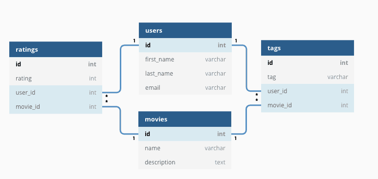

# **Web Development**

Session 2 - Backend

*[BY GDSC@KTH](https://gdsc.community.dev/kth-royal-institute-of-technology/)*

Zezhe Huang

<!-- _footer: "Powered by Marp for VS Code" -->

---

## What Can Be Expected Today?

- Manage blog data in database
- Build up APIs for a Blog app
  - Create, edit, view and delete blog data
- Access control
  - Only the author can access his/her blogs

---

## **Databases**

### Relation Databases (eg. PostgreSQL)



<!-- _footer: "https://www.omnisci.com/technical-glossary/relational-database" -->

---

## **Databases**

### NonSQL Databases (eg. MongoDB)


<!-- _footer: "https://docs.microsoft.com/en-us/dotnet/architecture/cloud-native/relational-vs-nosql-data" -->

---

### NonSQL Databases - Document

```json
{
    "FirstName": "Bob", 
    "Address": "5 Oak St.", 
    "Hobby": "sailing"
}
```

```xml
<contact>
    <firstname>Bob</firstname>
    <hobby>sailing</phone>
    <address>
      <street1>5 Oak St.</street1>
    </address>
</contact>
```

<!-- _footer: "https://en.wikipedia.org/wiki/Document-oriented_database" -->

---

### NonSQL Databases - Key-Value


<!-- _footer: "https://upload.wikimedia.org/wikipedia/commons/5/5b/KeyValue.PNG" -->

---

## **Authorization**

- Basic authentication
  -  Base64 encoding of ID and password joined by a single colon `:`
- OAuth 2.0
- **Json Web Token**
  - Less requests
  - Stateless
- ...

<!-- _footer: "https://en.wikipedia.org/wiki/Basic_access_authentication" -->

---

### **Json Web Token**


<!-- _header: "Authorization" -->
<!-- _footer: "https://www.vaadata.com/blog/jwt-tokens-and-security-working-principles-and-use-cases/" -->


---

## **Restful API**

REpresentational State Transfer （REST) architectural constraints:

1. Uniform interface
2. Client-server
3. Stateless
4. Cacheable
5. Layered system
6. Code on demand

<!-- _footer: "https://restfulapi.net/" -->

---

## **Setup of Django Project**

```shell
pip install django
django-admin startproject myblog
cd myblog
python manage.py migrate
python manage.py createsuperuser
```

Now have a look at the settings! What we'll use today:

- `INSTALLED_APPS`
- `DATABASES`

<!-- _footer: "https://www.djangoproject.com/start/" -->

---

### PostgreSQL Configuration

- Run docker instance: `docker run --name my-postgres -p 5432:5432 -e POSTGRES_PASSWORD=mypassword -d postgres`
- Access bash in docker instance: `docker exec -it DOCKER_ID bash`

```
su postgres
psql
CREATE DATABASE myblog;
```

<!-- _header: "Setup of Django Project" -->

---

### Project Settings

- Install database engine for django: `pip install psycopg2-binary`

```python
DATABASES = {
    'default': {
        'ENGINE': 'django.db.backends.postgresql',
        'NAME': 'myblog',
        'USER': 'postgres',
        'PASSWORD': 'mypassword',
        'HOST': 'localhost',
        'PORT': 5432,
    }
}
```


<!-- _header: "Setup of Django Project" -->

---

## **Blog Model**

- Create an app: `python manage.py startapp blogs`
- Add the app to settings:

```
INSTALLED_APPS = [
    ...
    'blogs',
]
```

---

<!-- _header: "Blog Model" -->

### Model CLass

Define the model in `models.py`

```python
class Blog(models.Model):
    author = models.ForeignKey(
        settings.AUTH_USER_MODEL,on_delete=models.CASCADE,
    )
    created_at = models.DateTimeField(auto_now_add=True)
    title = models.TextField()
    content = models.TextField()
```

Migrate to database:

```shell
python manage.py makemigrations
python manage.py migrate
```

---

<!-- _header: "Blog Model" -->

### Admin Page

Register to admin page in `admin.py`

```python
from django.contrib import admin
from blogs.models import Blog

class BlogAdmin(admin.ModelAdmin):
    pass
admin.site.register(Blog, BlogAdmin)
```

Run the server by 
`python manage.py runserver 0.0.0.0:8000`
and check out the admin page: http://localhost:8000/admin

---

## **Json Web Token**

Install Django REST framework JWT:
`pip install djangorestframework-simplejwt
`
<hr>

Follow the guide to configure

https://django-rest-framework-simplejwt.readthedocs.io/en/latest/getting_started.html#installation

---

## **Restful API**

Install Django REST framework:
`pip install djangorestframework`

<br>

Add `'rest_framework'` to your `INSTALLED_APPS` setting.

```python
INSTALLED_APPS = [
    ...
    'rest_framework',
]
```

---

<!-- _header: "Restful API" -->

### Serializer and ViewSet

Create `Serializer` and `Viewset` in `views.py`

```python
class BlogSerializer(serializers.ModelSerializer):
    author = serializers.PrimaryKeyRelatedField(read_only=True)
    class Meta:
        model = Blog
        fields = '__all__'


class BlogViewSet(viewsets.ModelViewSet):
    queryset = Blog.objects.all()
    serializer_class = BlogSerializer
```

---

<!-- _header: "Restful API" -->

### Router

Add urls in `urls.py`

```python
router = routers.SimpleRouter()
router.register(r'blogs', BlogViewSet)

urlpatterns = [
    ...
    path('', include(router.urls)),
]
```

Router document: https://www.django-rest-framework.org/api-guide/routers/

---

<!-- _header: "Restful API" -->

### Access Control

Only allow the author to change his/her blogs:

```python
class AuthorPermission(permissions.BasePermission):
    def has_object_permission(self, request, view, obj):
        if request.method in permissions.SAFE_METHODS:
            return True
        return obj.author == request.user
```

Assign it to the `permission_classes` of `BlogViewSet`:

`permission_classes = [AuthorPermission, ]`

---

## **Check Out Your Results**

Online demo: https://gdsc-web.herokuapp.com/

Available users:

`admin:admin`
`testuser:testpassword`

---

## Useful Links

- Authorization: https://learning.postman.com/docs/sending-requests/authorization/
